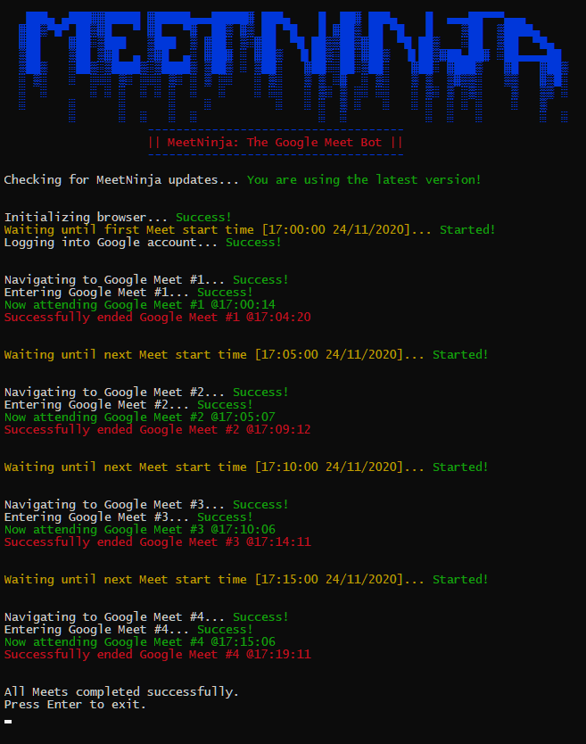
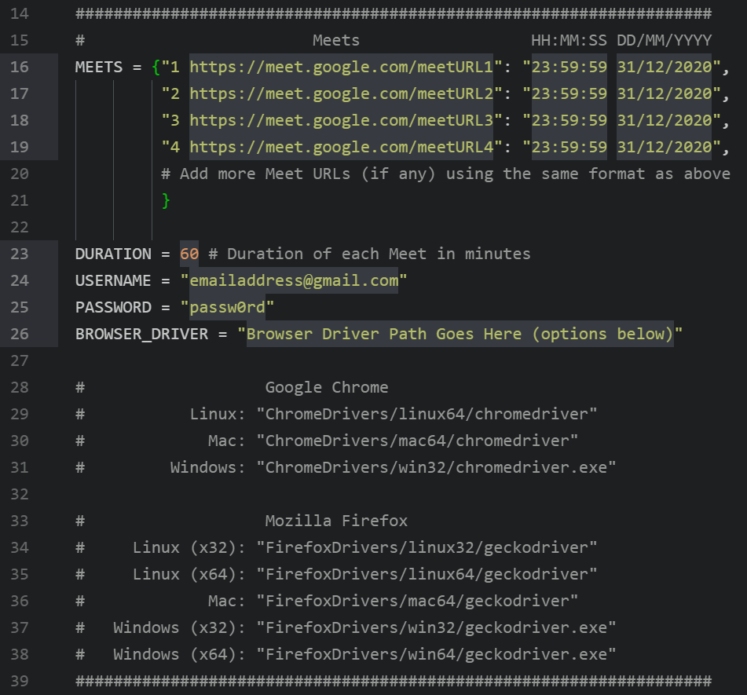

<!-- Improved compatibility of back to top link: See: https://github.com/othneildrew/Best-README-Template/pull/73 -->
<a name="readme-top"></a>
<!--
*** Thanks for checking out the Best-README-Template. If you have a suggestion
*** that would make this better, please fork the repo and create a pull request
*** or simply open an issue with the tag "enhancement".
*** Don't forget to give the project a star!
*** Thanks again! Now go create something AMAZING! :D
-->


<!-- PROJECT SHIELDS -->
<!--
*** I'm using markdown "reference style" links for readability.
*** Reference links are enclosed in brackets [ ] instead of parentheses ( ).
*** See the bottom of this document for the declaration of the reference variables
*** for contributors-url, forks-url, etc. This is an optional, concise syntax you may use.
*** https://www.markdownguide.org/basic-syntax/#reference-style-links
-->
<!-- [![Contributors][contributors-shield]][contributors-url]
[![Forks][forks-shield]][forks-url]
[![Stargazers][stars-shield]][stars-url]
[![Issues][issues-shield]][issues-url] -->
[![MIT License][license-shield]][license-url]
<!-- [![LinkedIn][linkedin-shield]][linkedin-url] -->


<!-- PROJECT LOGO -->
<br />
<div align="center">
  <a href="https://github.com/othneildrew/Best-README-Template">
    
  </a>

  <h3 align="center">MeetNinja</h3>

  <p align="center">
    A bot which attends your Google Meet for you
    <br />
    <!-- a href="https://github.com/othneildrew/Best-README-Template"><strong>Explore the docs »</strong></a> -->
    <br />
    <br />
<!--     <a href="https:passion8.vercel.app">View Demo</a> -->
    ·
    <a href="mailto:itsskofficial03@gmail.com">Report Bug</a>
    ·
    <a href="mailto:itsskofficial03@gmail.com">Request Feature</a>
  </p>
</div>


<!-- TABLE OF CONTENTS -->
<details>
  <summary>Table of Contents</summary>
  <ol>
    <li>
      <a href="#about-the-project">About The Project</a>
      <ul>
        <li><a href="#built-with">Built With</a></li>
      </ul>
    </li>
    <li>
      <a href="#getting-started">Getting Started</a>
      <ul>
        <li><a href="#prerequisites">Prerequisites</a></li>
        <li><a href="#installation">Installation</a></li>
      </ul>
    </li>
    <li><a href="#usage">Usage</a></li>
    <li><a href="#roadmap">Roadmap</a></li>
    <li><a href="#contributing">Contributing</a></li>
    <li><a href="#license">License</a></li>
    <li><a href="#contact">Contact</a></li>
    <li><a href="#acknowledgments">Acknowledgments</a></li>
  </ol>
</details>


<!-- ABOUT THE PROJECT -->
## About The Project

[![MeetNinja Screen Shot][product-screenshot]]

A super dope tool that attends your Google Meet(s) for you on autopilot while you sleep or work on something else. MeetNinja flawlessly handles multiple Meet sessions, background activity, scheduling, and also disables your Meet camera and microphone in-Meet! It is also equipped with color-coded, concise activity logging (verbose) with timestamps of all joining and ending activities for each Meet session (to assure you—upon your return—that your Meets were *indeed* successfully attended). Supports Google Chrome and Mozilla Firefox, on Linux, Mac, and Windows.
</br>
- Multiple Meet sessions supported, according to the user-defined Meet schedule
- Works even with the display on sleep (and will not wake it up either)
- Works even in the background while you do other work (as long as you do not *explicitly* "Minimize" the browser window MeetNinja generates; just keep it open in the background, beneath your current open window(s))
- Automatically disables camera and microphone in-Meet
- Color-coded and concise activity logging (verbose) with timestamps of all activities
- Supported web browsers: Google Chrome and Mozilla Firefox
- Supported platforms: Linux, Mac, and Windows
- Automatically checks for a newer MeetNinja version upon every execution

<p align="right">(<a href="#readme-top">back to top</a>)</p>

### Built With

This section should list any major frameworks/libraries used to bootstrap your project. Leave any add-ons/plugins for the acknowledgements section. Here are a few examples.

* [![Python][Python]][Python-url]
* [![Selenium][Selenium]][Selenium-url]

<p align="right">(<a href="#readme-top">back to top</a>)</p>


<!-- GETTING STARTED -->
## Getting Started

To get a local copy up and running follow these simple example steps.

### Prerequisites

This is an example of how to list things you need to use the software and how to install them.
* pip
* selenium (for web browser-based automation)
* requests (for automatic update checks)
* datetime (for scheduling & timestamps)
* pause (for scheduling)
* colorama (for colors)
* termcolor (for colors)
  ```sh
  pip install <package-name>
  ```

### Installation


1. Clone this repository or download it as a ZIP file (and extract its contents)

2. PIP-install all the packages mentioned under the [last subheading] on this page, either automatically via running the `pip install -r requirements.txt` command, or manually via separate `pip install` commands for each package

3. Do not run MeetNinja.py just yet. First, open it using any editor, and substitute your inputs (Google Meet URLs, their start times, duration of all Meets, Google username, password, path to the web driver file of your respective browser and OS) into the dummy values in the following section of the code (highlighted):

<div align="center">

<p>Values to Substitute</p>
</div>

4. Save your changes, and run the program (either by double-clicking MeetNinja.py, or executing it via a terminal window if you are feeling particularly geeky today)

5. Take the chillest of pills (figuratively) and abandon all your worries; MeetNinja's got your back

<p align="right">(<a href="#readme-top">back to top</a>)</p>


<!-- USAGE EXAMPLES -->
## Usage

Upon execution, MeetNinja generates a new Google Chrome / Mozilla Firefox window in Developer Mode, and this new window stays idle until it is time to join your first Meet (according to your schedule). Once it is time, MeetNinja automatically logs you into your Google account, navigates to the first Meet URL, disables your camera and microphone, joins the Meet session, and then waits until the duration specified (60 minutes by default) before ending the call and repeating the same for the *next* Meet session (whenever it may be) and so on, until your schedule has exhausted *(phew)* — all this with just a single (double) click!
You may use MeetNinja paired with Wake-on-LAN / Magic Packet (if your motherboard and network adapter support it) for the optimal, ultimate "Away From Keyboard" automation experience.

You would be surprised by how common a feature WoL is in most modern *and* semi-modern systems. Hence, definitely *do* check it out. It is super cool, convenient, easy, helpful, and—importantly—native.

I highly recommend [**this Android app**](https://play.google.com/store/apps/details?id=co.uk.mrwebb.wakeonlan "this Android app") (ad-free, free, light, simple) for sending WoL packets to your computer system over the air and triggering a wake-up from the Hibernation / Sleep state without even touching the system (ironic how you would wake your system up so you could sleep, hah!).

You may also need or use the above remote desktop client(s) if you need to mid-sleep-check on your progress or if your computer system has a login password you may need to enter remotely after a Wake-on-LAN.

Some points tp note

1. MeetNinja works even in the background while you do other work on other windows, as long as you **do not *explicitly* "Minimize" MeetNinja's generated browser window**; just keep it open in the background, beneath your current open window(s)

2. There is *deliberately* no Headless Mode (at the moment) due to potential complications arising from exiting MeetNinja while a Meet is still active (such as the Meet not relatively "naturally" ending and you being a part of the Meet unknowingly till the end of time)

3. Although you may abort the process at any stage or time by pressing CTRL + C from within the MeetNinja console / terminal window, it is not advised to do so from within an active Meet (for reasons similar to the previous point)

4. There is *deliberately* no audio output muting due to potential situations such as roll-calls or surprise questions for which you may need to intervene unexpectedly. Besides, you can either mute the tab manually if you are working on something else; or just entirely mute your system if you are planning on sleeping anyway

<p align="right">(<a href="#readme-top">back to top</a>)</p>


<!-- ROADMAP -->
<!-- ## Roadmap

- [x] Add more animations
- [x] Add back to top links
- [ ] Add Additional Templates w/ Examples
- [ ] Add "components" document to easily copy & paste sections of the readme
- [ ] Multi-language Support
    - [ ] Chinese
    - [ ] Spanish

See the [open issues](https://github.com/othneildrew/Best-README-Template/issues) for a full list of proposed features (and known issues).

<p align="right">(<a href="#readme-top">back to top</a>)</p> -->


<!-- CONTRIBUTING -->
## Contributing

Contributions are what make the open source community such an amazing place to learn, inspire, and create. Any contributions you make are **greatly appreciated**.

If you have a suggestion that would make this better, please fork the repo and create a pull request. You can also simply open an issue with the tag "enhancement".
Don't forget to give the project a star! Thanks again!

1. Fork the Project
2. Create your Feature Branch (`git checkout -b feature/AmazingFeature`)
3. Commit your Changes (`git commit -m 'Add some AmazingFeature'`)
4. Push to the Branch (`git push origin feature/AmazingFeature`)
5. Open a Pull Request

<p align="right">(<a href="#readme-top">back to top</a>)</p>


<!-- LICENSE -->
## License

Distributed under the MIT License. See `LICENSE.txt` for more information.

<p align="right">(<a href="#readme-top">back to top</a>)</p>


<!-- CONTACT -->
<!-- ## Contact

Your Name - [@your_twitter](https://twitter.com/your_username) - email@example.com

Project Link: [https://github.com/your_username/repo_name](https://github.com/your_username/repo_name)

<p align="right">(<a href="#readme-top">back to top</a>)</p> -->


<!-- ACKNOWLEDGMENTS -->
<!-- ## Acknowledgments

Use this space to list resources you find helpful and would like to give credit to. I've included a few of my favorites to kick things off!

<!-- * [Choose an Open Source License](https://choosealicense.com)
* [GitHub Emoji Cheat Sheet](https://www.webpagefx.com/tools/emoji-cheat-sheet)
* [Malven's Flexbox Cheatsheet](https://flexbox.malven.co/)
* [Malven's Grid Cheatsheet](https://grid.malven.co/)
* [Img Shields](https://shields.io)
* [GitHub Pages](https://pages.github.com) -->
<!-- * [Font Awesome](https://fontawesome.com)
* [Freepik](https://freepik.com) -->

<!-- <p align="right">(<a href="#readme-top">back to top</a>)</p> -->


## Contributors

Thanks goes to these wonderful people ([emoji key](https://allcontributors.org/docs/en/emoji-key)):
</br>
Major work is done by SHUR1K-N. I have updated that project to support Selenium 4 and meet my needs
<!-- ALL-CONTRIBUTORS-LIST:START - Do not remove or modify this section -->
<!-- prettier-ignore-start -->
<!-- markdownlint-disable -->
<table>
  <tr>
     <td align="center"><a href="https://github.com/itsskofficial"><br /><sub><b>Sarthak Karandikar</b></sub></a><br /> <a href="https://github.com/Passion9-App/Passion8-App.github.io/commits?author=itsskofficial" title="Code">💻</a></td>
    <td align="center"><a href="https://github.com/SHUR1K-N"><br /><sub><b>SHUR1K-N</b></sub></a><br/> <a href="https://github.com/SHUR1K-N/MeetNinja-Google-Meet-Bot" title="Code">💻</a></td>
   
  </tr>
</table>


<p align="right">(<a href="#readme-top">back to top</a>)</p>
<!-- markdownlint-restore -->
<!-- prettier-ignore-end -->

<!-- ALL-CONTRIBUTORS-LIST:END -->


<!-- MARKDOWN LINKS & IMAGES -->
<!-- https://www.markdownguide.org/basic-syntax/#reference-style-links -->
[contributors-shield]: https://img.shields.io/github/contributors/othneildrew/Best-README-Template.svg?style=for-the-badge
[contributors-url]: https://github.com/itsskofficial/Web2/passion8/graphs/contributers
[forks-shield]: https://img.shields.io/github/forks/othneildrew/Best-README-Template.svg?style=for-the-badge
[forks-url]: https://github.com/itsskofficial/Web2/passion8/network/members
[stars-shield]: https://img.shields.io/github/stars/othneildrew/Best-README-Template.svg?style=for-the-badge
[stars-url]: https://github.com/itsskofficial/Web2/passion8/stargazers
[issues-shield]: https://img.shields.io/github/issues/othneildrew/Best-README-Template.svg?style=for-the-badge
[issues-url]: https://github.com/othneildrew/Best-README-Template/issues
[license-shield]: https://img.shields.io/github/license/othneildrew/Best-README-Template.svg?style=for-the-badge
[license-url]: https://github.com/othneildrew/Best-README-Template/blob/master/LICENSE.txt
[linkedin-shield]: https://img.shields.io/badge/-LinkedIn-black.svg?style=for-the-badge&logo=linkedin&colorB=555
[linkedin-url]: https://linkedin.com/in/othneildrew
[product-screenshot]: Images/Example.png
[Python]:https://img.shields.io/badge/Python-informational?style=flat&logo=python&logoColor=white&color=3776AB
[Python-url]: https://python.org
[Next.js]: https://img.shields.io/badge/next.js-000000?style=for-the-badge&logo=nextdotjs&logoColor=white
[Next-url]: https://nextjs.org/
[React.js]: https://img.shields.io/badge/React-20232A?style=for-the-badge&logo=react&logoColor=61DAFB
[React-url]: https://reactjs.org/
[Vue.js]: https://img.shields.io/badge/Vue.js-35495E?style=for-the-badge&logo=vuedotjs&logoColor=4FC08D
[Vue-url]: https://vuejs.org/
[Angular.io]: https://img.shields.io/badge/Angular-DD0031?style=for-the-badge&logo=angular&logoColor=white
[Angular-url]: https://angular.io/
[Svelte.dev]: https://img.shields.io/badge/Svelte-4A4A55?style=for-the-badge&logo=svelte&logoColor=FF3E00
[Svelte-url]: https://svelte.dev/
[Laravel.com]: https://img.shields.io/badge/Laravel-FF2D20?style=for-the-badge&logo=laravel&logoColor=white
[Laravel-url]: https://laravel.com
[Bootstrap.com]: https://img.shields.io/badge/Bootstrap-563D7C?style=for-the-badge&logo=bootstrap&logoColor=white
[Bootstrap-url]: https://getbootstrap.com
[JQuery.com]: https://img.shields.io/badge/jQuery-0769AD?style=for-the-badge&logo=jquery&logoColor=white
[JQuery-url]: https://jquery.com 
[HTML5]:https://img.shields.io/badge/HTML5-informational?style=flat&logo=html5&logoColor=white&color=E34F26
[HTML5-url]: https://developer.mozilla.org/en-US/docs/Glossary/HTML5
[CSS3]:https://img.shields.io/badge/CSS3-informational?style=flat&logo=css3&logoColor=white&color=1572B6
[CSS3-url]:https://developer.mozilla.org/en-US/docs/Web/CSS
[JavaScript]:https://img.shields.io/badge/Javascript-informational?style=flat&logo=javascript&logoColor=white&color=F7DF1E
[JavaScript-url]:https://developer.mozilla.org/en-US/docs/Web/JavaScript
[Selenium]:https://img.shields.io/badge/Selenium-informational?style=flat&logo=selenium&logoColor=white&color=#43B02A
[Selenium-url]:https://selenium.dev

